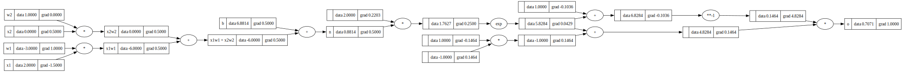

# Micrograd

A lightweight autograd engine that implements backpropagation (reverse-mode automatic differentiation) over a dynamically built DAG. This project is inspired by Andrej Karpathy's micrograd implementation.

## Overview

Micrograd is a minimal neural network library that demonstrates the fundamentals of automatic differentiation and neural networks from scratch. It supports:

- Scalar-valued operations
- Automatic differentiation
- Basic neural network operations
- Dynamic computation graph construction

## Computation Graph Visualization

The visualization above shows an example computation graph generated by Micrograd, demonstrating how operations are tracked and gradients are computed through backpropagation.

## Features

- **Automatic Differentiation**: Tracks computations and computes gradients automatically
- **Neural Network Building Blocks**: Includes basic components for building neural networks
- **Visualization Tools**: Provides tools to visualize computation graphs
- **Pure Python**: Implemented in pure Python with no external dependencies for core functionality
